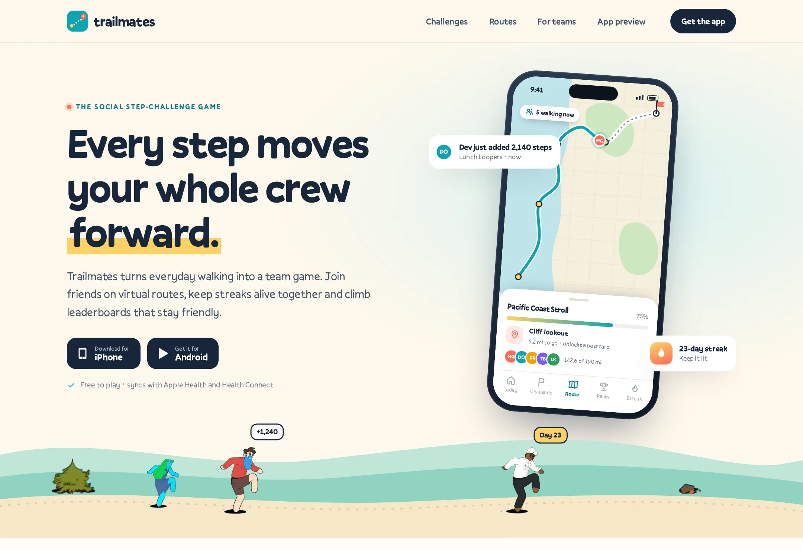

# Trailmates

The social step-challenge game: team walking challenges, virtual routes, streaks and friendly leaderboards.

**Live demo:** https://www.freelancerportfoliohub.com/jameslee/projects/trailmates/index.html



## Overview

Trailmates turns everyday walking into a team sport. Crews pool their steps to race other teams, move a shared pin
along illustrated virtual routes and keep streaks alive together. This repository contains:

- **`/` (Next.js)** — the launch site: home, challenge formats, the route library with hand-drawn maps, the teams page
  with an organizer dashboard and pricing, and an interactive five-screen app preview.
- **`mobile/` (Expo)** — the iPhone and Android app built with Expo Router: Today, Challenge, Route, Ranks and Streak.

Route maps are generated, not drawn by hand per page: each route is a list of control points that becomes a
Catmull-Rom spline, and the team pin is placed by arc length, so the same data renders the website cards, the large
hero map and the in-app route screen.

## Features

- **Today** — gradient step ring, streak/miles/minutes chips, live relay standing and route progress
- **Team challenges** — team-vs-team totals, crew leaderboard for the day and a one-tap cheer
- **Virtual routes** — six routes across five terrains, checkpoints, finish flag and team pin (`lib/routes.ts`)
- **Leaderboards** — friends, team and office boards with a podium and gentle rank-change indicators
- **Streaks** — month calendar with goal levels and shielded rest days, plus earned badges
- **Organizer dashboard** — league KPIs, daily steps chart and team table
- **Fair-play scoring** — baseline handicaps, most-improved and spike review in `lib/scoring.ts`
- **API** — `POST /api/challenges`, `POST /api/steps` (health sync), `GET /api/leaderboard?board=`

## Tech stack

| Layer   | Tools                                                              |
| ------- | ------------------------------------------------------------------ |
| Web     | Next.js 15 (App Router), React 19, TypeScript (strict), CSS, `next/font/local` (Pally) |
| API     | Route handlers, zod                                                |
| Mobile  | Expo SDK 54, Expo Router 6, React Native 0.81, react-native-svg, expo-haptics |
| Tooling | ESLint 9, Prettier, pnpm                                           |

## Getting started

```bash
pnpm install
pnpm dev            # http://localhost:3000
```

Mobile app:

```bash
cd mobile
pnpm install
pnpm start          # i for iOS simulator, a for Android
```

No environment variables are required.

## Project structure

```
.
├── app/                   # /, /challenges, /routes, /teams, /app, api/
│   ├── fonts/             # Pally 400/500/700
│   └── globals.css
├── components/
│   ├── brand/ layout/ ui/ # mark, header/footer, download band, icons, avatar, FAQ
│   ├── map/               # RouteMap + terrain layers
│   ├── phone/             # phone frame, status bar, step ring, screens/
│   ├── home/ challenges/ routes/ teams/
│   └── preview/           # PhonePreview (scroll-snap carousel)
├── lib/
│   ├── data/              # crew, routes, challenges, teams, marketing, preview
│   ├── routes.ts          # spline + arc-length pin placement
│   ├── scoring.ts         # totals, handicaps, spike review, rankings
│   └── validation.ts      # zod schemas for the API
├── types/
├── public/images/
└── mobile/
    ├── app/(tabs)/        # index (Today), challenge, route, ranks, streak
    ├── components/        # RouteMap, StepRing, Segmented, Avatar, ...
    ├── constants/theme.ts
    └── lib/               # mock-data, routes, format, types
```

## Scripts

| Command          | Description                   |
| ---------------- | ----------------------------- |
| `pnpm dev`       | Start the site with Turbopack |
| `pnpm build`     | Production build              |
| `pnpm start`     | Serve the production build    |
| `pnpm lint`      | ESLint                        |
| `pnpm typecheck` | `tsc --noEmit`                |
| `pnpm format`    | Prettier                      |

In `mobile/`: `pnpm start`, `pnpm ios`, `pnpm android`, `pnpm lint`, `pnpm typecheck`.
